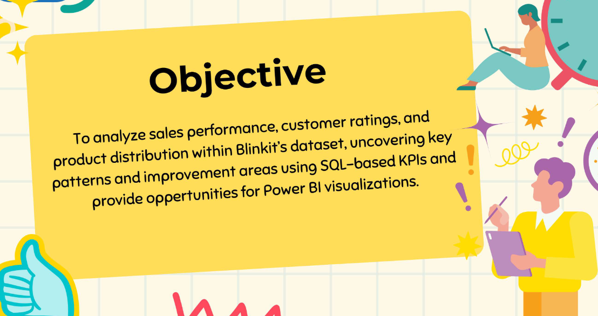

# 🛒 Blinkit Sales Analysis Using SQL

## 📊 Project Objective

To analyze sales performance, customer ratings, and product distribution within Blinkit’s dataset, uncovering key patterns and improvement areas using SQL-based KPIs and provide oppertunities for Power BI visualizations.

---

## 📁 Files Included

- `Blinkit Analysis.pdf` – Presentation with visuals and KPIs in pdf
- `Blinkit Analysis.pptx` – Presentation with visuals and KPIs in pptx
- `CSV File` - Contain CSV files.
- `SQL Files` - SQL queries files.

---

## 🛠️ Skills Demonstrated

- SQL (Joins, Aggregations, Group By, Window Functions)
- Data Cleaning & Transformation
- Business Intelligence Reporting
- KPI Calculation & Trend Analysis
- PowerPoint Dashboard Design

---

## 🔍 Key Insights

- Low Fat items generated higher revenue compared to Regular items
- Snack Foods and Fruits & Vegetables are the highest-selling categories
- Tier 1 cities significantly outperform Tier 2 & 3 in terms of total sales
- Medium-sized outlets contribute the highest sales percentage
- Outlets established post-2000 show strong and consistent performance

---

## 📄 Use Case

This project was created to showcase SQL-driven analysis for Data Analyst roles. It reflects the ability to:
- Clean and standardize large-scale retail data
- Write optimized SQL queries to extract metrics and trends
- Present data insights visually for decision-making support

---

## 👤 About Me

**Shubham Kumar**  
Aspiring Data Analyst | SQL • Excel • Python • Power BI  
[LinkedIn](https://www.linkedin.com/in/shubham-kumar-375410257) • [GitHub](https://github.com/shubhamkumar200328)

